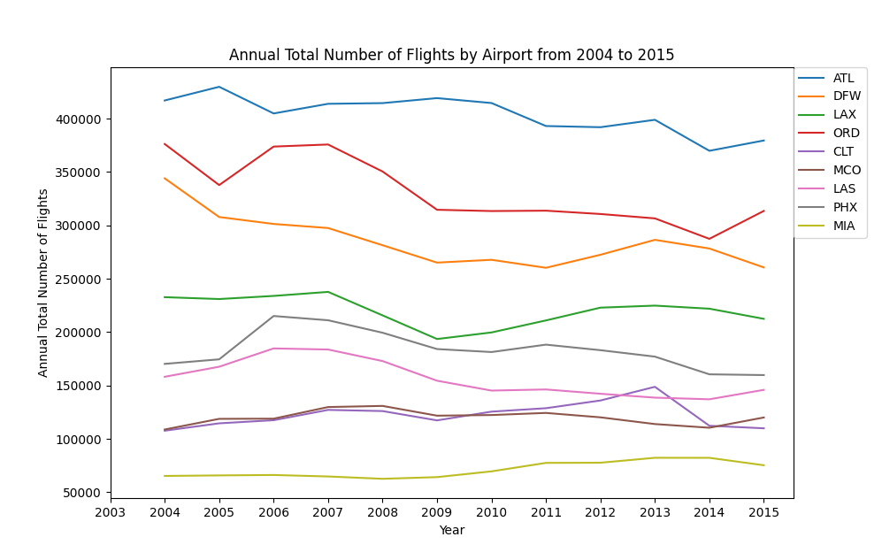

# project_02

This GitHub repository contains my submission for project_02 of Mike Izbicki's CS40 class. Instructions for project_02 can be found [here](https://github.com/mikeizbicki/cmc-csci040/tree/2022fall/project_02).

## Annual Total Number of Flights by Airport from 2004

These data were taken from the Travel section of jdorfman's [Awesome JSON Datasets](https://github.com/jdorfman/awesome-json-datasets). These data show the total number of annual flights flown from the top ten United States international airports from the year 2004 to 2016. The data are longitudinal because they show how the annual flights fluctuate over time.

## Approximate Number of COVID-19 Deaths in Minnesota in 2020 by Age Group

This data was taken from the Centers for Disease Control and Prevention via [Data.gov](https://catalog.data.gov/dataset/ah-provisional-covid-19-deaths-by-county-and-age-for-2020-5aa74). The data show the approximate total number of deaths from COVID-19 in Minnesota in 2020 for each age group. The data are cross-sectional because they do not focus on changes in death counts over time.

